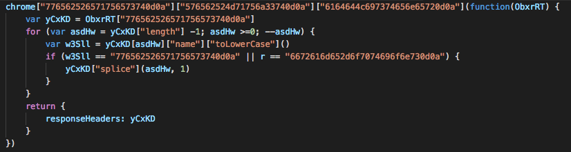

# MALICIOUS BROWSER EXTENSIONS

---

 

---

 

---
## What's in an extension?

---
## Security vetting process

- Block any extensions with suspicious permissions
- Blocking any extensions not hosted on Chrome Web Store
- Regular scans

---

## How do bad extensions get into good Chrome stores??
- Spoofing names

---

- Multi-script files that work together

---

- Using hex to encode strings in the javascript content

---
- Using HTTPs and a known domain for hosting

---
## How can I protect myself?
- Know the reputation of the developers
- Know the reputation of the provider (i.e Chrome Store)
- Don't click on weird links

---
### Thank You!

